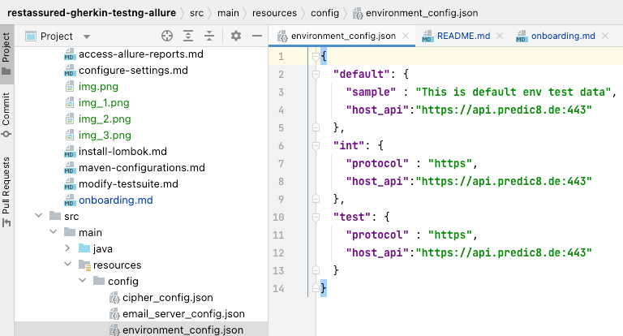
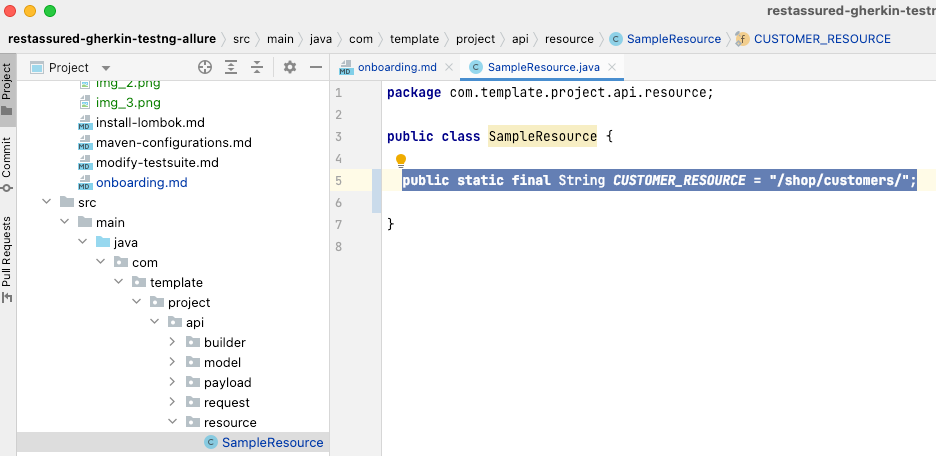
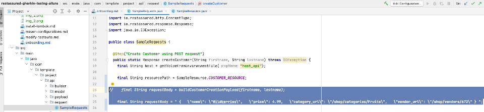
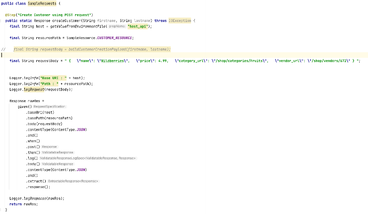
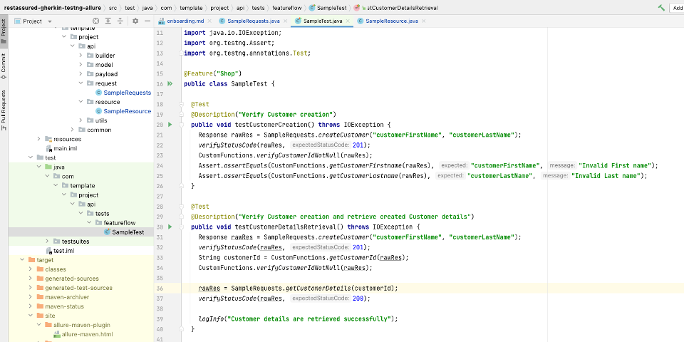
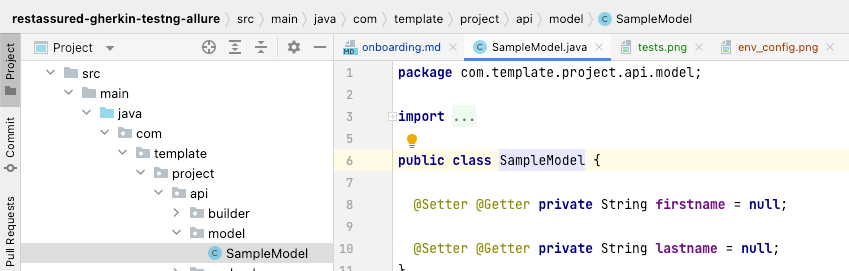
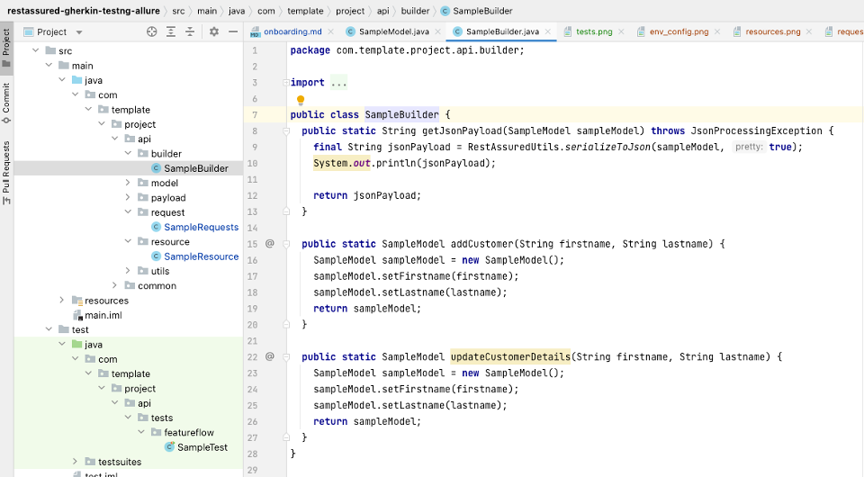
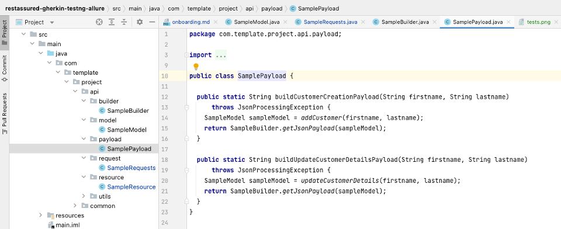
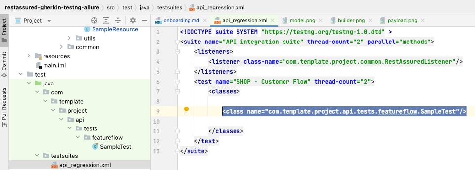

### Sample Task to practice: Fruit Shop API

**URL:** https://api.predic8.de/shop/docs#/products

_Think about the functionality of a the REST method "products" of the Fruit Shop API. Create HTTP requests for all CRUD actions (Create/Read/Update/Delete) such as :_

- create a new product
- read this product data
- update product data
- delete this product
- list all products

#### Primary Task: (Create requests and tests by passing request body as a String)
1. Provide the base uri (Uniform Resource Identifier) via environment_config file within resources/config

2. Provide the resource in the resource class

3. Provide request body (Payload) as a string
(comment out :  //String requestBody = SamplePayload.buildCustomerCreationPayload(firstname, lastname);
   Example:
   String requestBody = " {   "name": "Wildberries",   "price": 4.99,   "category_url": "/shop/categories/Fruits",   "vendor_url": "/shop/vendors/672" } "

4. Create sample requests (POST / GET / PUT / DEL)

5. Create tests for the response received to make your tests more effective


#### Secondary Task: (Create requests and tests by Builder design pattern)
1. Create a model

2. Create a builder

3. Build the payload by parsing JSON objects


Build below payloads:

**Payload 1:**
```
{
"name": "Payload1",

"task": "build a payload",

"onboardingAutomationTool": "rest-assured",

"onboardingProgrammingLanguage": "Java"
}
```

**Payload 2:**
```
{
"name": "Payload2",

"task": "build a payload",

"onboarding": {

"tool": "sampleTool",

"language": "sampleLanguage"
}

} 
```

**Payload 3:**
```
{

"name": "Payload3",

"task": "build a Payload",

"program": {

"duration": 4 ,

"sector": "quality assurance"

} ,

"onboarding": [ {

"tool": "Selenium",

"language" : "Java"

}, {

"tool" : "Rest-Assured",

"language" : "Java"

} ]

}
```

4. Print the payload created

5. Create a test suite


<p align="center">
    <a align="middle" href="https://github.com/ParthibanRajasekaran/restassured-gherkin-testng-allure/blob/main/README.md">Take me back
      
    </a>
</p>